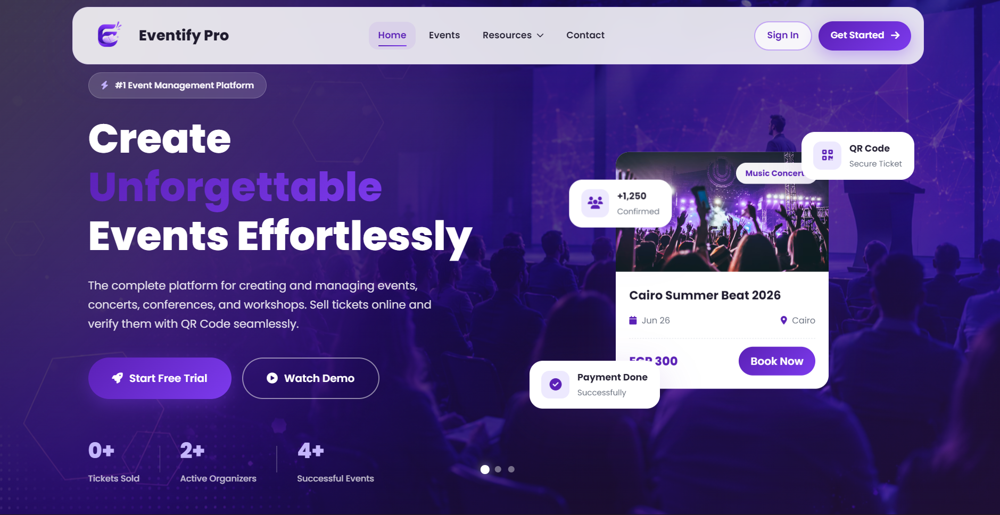
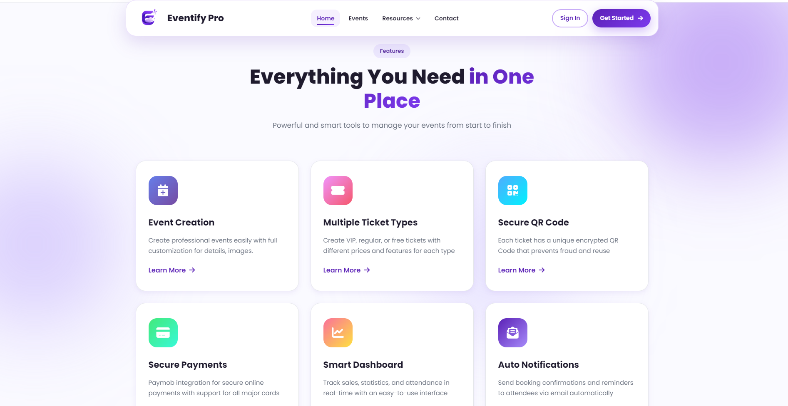
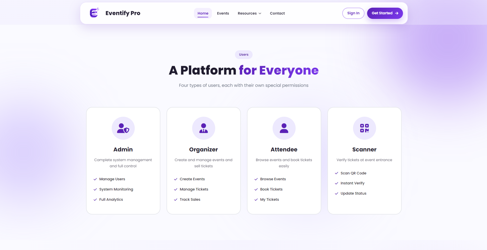
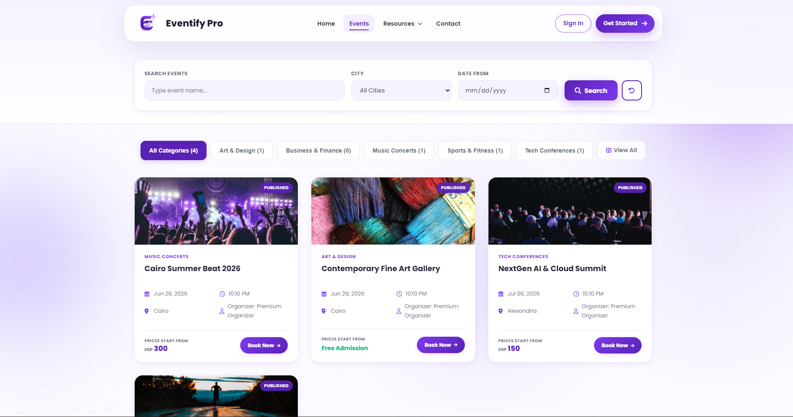
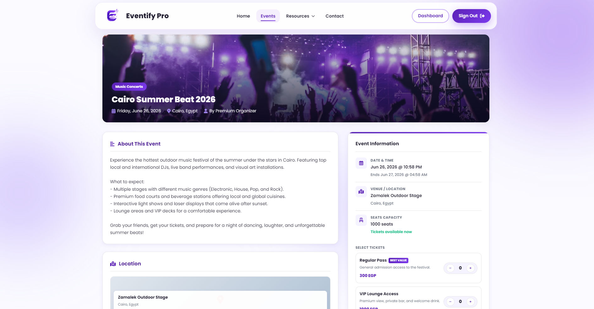
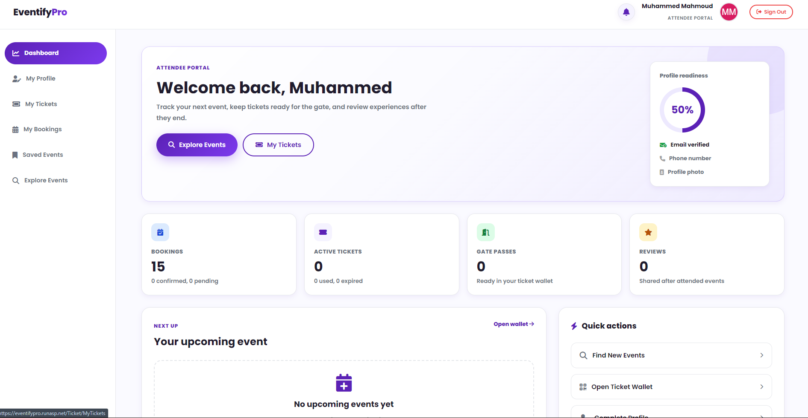
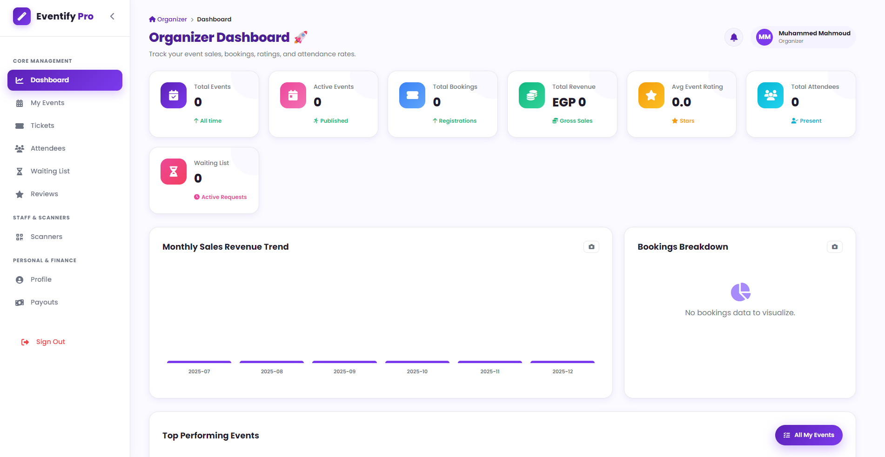
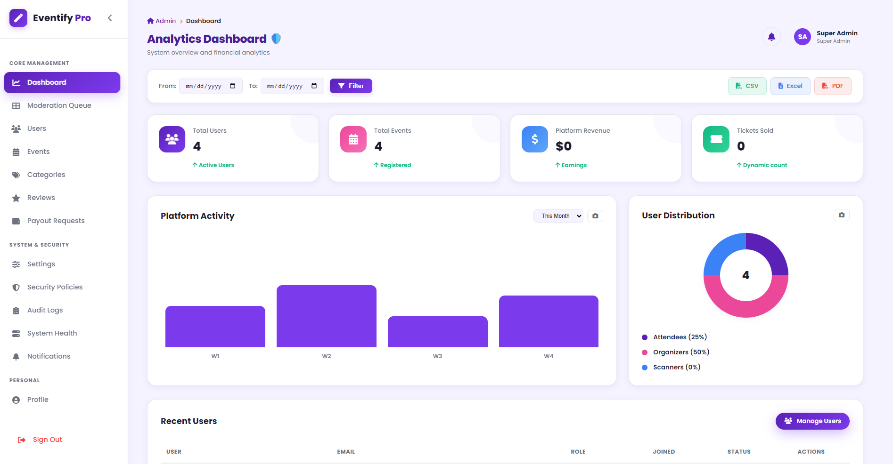
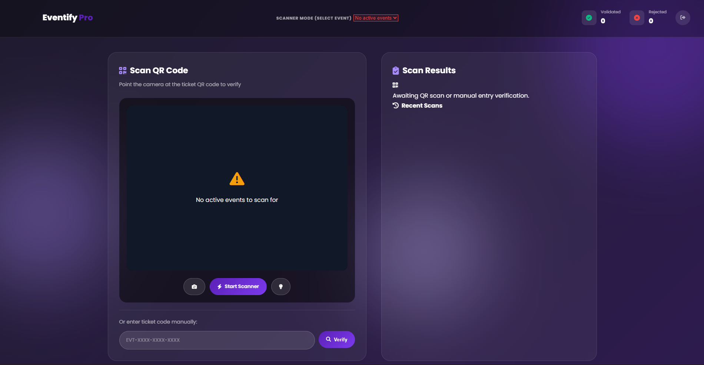

# 🎉 Eventify Pro

<div align="center">


**A full-featured, role-driven Event Management & Ticketing Platform**

[Features](#-features) • [Tech Stack](#-tech-stack) • [Architecture](#-architecture) • [Database](#-database-design) • [Setup](#-getting-started) • [Configuration](#-configuration)

</div>

---

🔗 **Live Website:** [https://eventifypro.runasp.net](https://eventifypro.runasp.net)

## 🖼️ Screenshots & Demo

<div align="center">
  
  
  
  
  
  
  
  
  
</div>


🎬 **Demo video:** [Watch on YouTube](#)


---

## 📋 Table of Contents

- [Project Overview](#-project-overview)
- [Features](#-features)
- [Tech Stack](#-tech-stack)
- [Architecture](#-architecture)
- [Database Design](#-database-design) *(expandable — full schema inside)*
- [Project Structure](#-project-structure) *(expandable — full solution tree inside)*
- [Getting Started](#-getting-started)
- [Configuration](#-configuration)
- [User Roles](#-user-roles)
- [User Flows](#-user-flows)
- [Domain Entities](#-domain-entities)
- [Key Design Decisions](#-key-design-decisions)
- [NuGet Packages](#-nuget-packages)
- [API Routes (MVC Actions)](#-api-routes-mvc-actions) *(expandable — full route table inside)*
- [Security Considerations](#-security-considerations)
- [Seed Data](#-seed-data)
- [Performance Notes](#-performance-notes)
- [Challenges We Faced](#-challenges-we-faced)
- [Future Work](#-future-work)
- [Contributing](#-contributing)
- [Team](#-team)
- [License](#-license)

---

## 🌟 Project Overview

**Eventify Pro** is a full-featured, role-driven web application for end-to-end event management, built with **ASP.NET Core MVC 8**, **Entity Framework Core 8 (Code-First)**, and **SQL Server**. It follows a strict **N-Tier architecture** spanning five projects — `Domain`, `Shared`, `DAL`, `BLL`, `Web` — and was built to handle the real operational complexity of running ticketed events: overselling prevention under concurrent traffic, fraud-resistant gate check-in, multi-gateway payments tuned for the Egyptian market, and email delivery that survives SMTP outages.

The system enables:

- **Organizers** to register, get verified, publish events, define multiple ticket tiers, monitor live sales dashboards, export attendance and reviews to Excel, and request payouts of their revenue.
- **Attendees** to browse events by category, save favorites, book multiple ticket types in a single order, pay via **Stripe** or **Paymob**, and download a QR-secured PDF ticket.
- **Scanners** to validate entry tickets at the venue door in real time through a browser-based QR scanner with instant fraud and duplicate detection.
- **Admins** to govern the entire platform — accounts, organizer approvals, categories, event moderation, payout approvals, audit trails, and system-wide analytics.

> 🎓 Built as a graduation project.

---

## ✨ Features

### Core Features

| Feature | Description |
|---|---|
| **Event Creation** | Organizers create events with title, description, dates, location, capacity, cover image, and category. Events go through an admin approval workflow before going live. |
| **Ticket Types** | Multiple ticket tiers per event (VIP, Regular, Free) with independent pricing and capacity tracking (`SoldQuantity` vs `TotalQuantity`). |
| **Multi-Ticket Cart** | Attendees book several ticket types in one order via `BookingItems`, issuing fully independent ticket codes from a single checkout. |
| **Overselling Prevention** | Ticket capacity is protected with software-level concurrency control — the second of two simultaneous bookings on the last seat automatically fails. |
| **Payment Integration** | Paymob (cards + e-wallets like Vodafone Cash) for production, with a Dummy gateway for frictionless local development. |
| **QR Code Generation** | Cryptographically secure HMAC-SHA256 signed token embedded in every ticket's QR code. |
| **QR Validation & Fraud Detection** | Real-time camera-based scanning with instant color-coded results: valid, already used, wrong event, or forged/unknown. |
| **PDF Ticket** | Downloadable, printable ticket with the embedded QR code. |
| **Email Notifications** | Booking confirmations, OTP codes, and reminders delivered reliably through the **Outbox Pattern**, immune to temporary SMTP failures. |
| **Identity & Auth** | ASP.NET Core Identity + Google OAuth + email OTP verification, with role-based access (Admin, Organizer, Attendee, Scanner). |
| **Organizer Dashboard** | Real-time sales and revenue charts (Chart.js), plus one-click export of attendee lists and reviews to styled Excel workbooks via **ClosedXML**. |
| **Admin Panel** | Full platform governance — users, organizer approvals, categories, event moderation, payout approvals, audit log review. |
| **Reviews & Ratings** | Post-event ratings (1–5 stars) with admin soft-moderation (`IsHidden`). |
| **Waiting List (FIFO)** | Automatic queue when a ticket type sells out; the first person in line is notified on cancellation and given a time-boxed window to buy. |
| **Cancellations & Refunds** | Attendee self-cancellation with partial/full refund tracking and admin-initiated refunds. |
| **Audit Logging & Archiving** | Every sensitive action is logged with old/new values, IP, and user agent; old logs are migrated nightly to an archive table by a Hangfire job. |
| **Rate Limiting & IP Whitelisting** | Request throttling on sensitive endpoints and IP-restricted access to the admin area. |

### Design Patterns Applied

- ✅ Repository Pattern + Unit of Work
- ✅ N-Tier Architecture
- ✅ SOLID Principles
- ✅ Soft Delete / Soft Moderation (`IsHidden`, `IsActive`, `IsApproved`)
- ✅ Optimistic Concurrency (row-version locking on `TicketTypes`)
- ✅ Transactional Outbox Pattern (`OutboxMessages` + Hangfire processing)
- ✅ Decorator Pattern (`HangfireOutboxServiceDecorator` wraps `IOutboxService` for scheduled execution)
- ✅ Strategy Pattern (interchangeable Paymob / Dummy payment services behind a common interface)
- ✅ Global Query Filters (EF Core) — soft-hidden reviews never leak into public queries
- ✅ Filter-based Authorization (`VerifiedOrganizerFilter`, `AdminIpWhitelistFilter`, `RateLimitAttribute`)
- ✅ Cross-Cutting Audit Logging via Action Filter (`AuditLogAttribute`)

---

## 🛠 Tech Stack

| Layer | Technology |
|---|---|
| **Presentation** | ASP.NET Core MVC 8, Razor Views, Tag Helpers, Bootstrap 5, jQuery |
| **Business Logic** | C# 12 service classes, Mapster (object mapping), FluentValidation |
| **Data Access** | EF Core 8 (Code-First, Fluent API), Generic Repository, Unit of Work |
| **Database** | Microsoft SQL Server |
| **Authentication** | ASP.NET Core Identity, role-based authorization, filter-based ownership checks |
| **Social Login** | Google OAuth 2.0 |
| **OTP** | Email-delivered, time-limited verification codes |
| **QR Code** | QRCoder (generation) + browser-based camera scanning (html5-qrcode style) |
| **PDF Export** | Server-side PDF rendering for tickets |
| **Email** | SMTP (Gmail) routed through the Transactional Outbox |
| **Payments** | custom Paymob HTTP integration, Dummy payment service |
| **Excel Export** | ClosedXML — styled, formatted workbooks for attendance and reviews |
| **Background Jobs** | Hangfire (recurring jobs, dashboard, retry policies) |
| **Object Mapping** | Mapster — one mapping register per domain area |
| **Validation** | FluentValidation — one validator per DTO |
| **Caching** | ASP.NET Core Output Caching with custom invalidation service |

---

## 🏗 Architecture

The solution follows **N-Tier Clean Architecture** with a strict, unidirectional dependency flow:

```
EventifyPro.Web  ──→  EventifyPro.BLL  ──→  EventifyPro.DAL  ──→  EventifyPro.Domain
                            ↑                     ↑                     ↑
                      EventifyPro.Shared ←─────────────────────────────┘
```

### Dependency Rule

> No layer references a layer above it. `Web` never touches `DAL` directly — every operation goes through a `BLL` service.

### Projects

```
EventifyPro.sln
├── EventifyPro.Domain   → Entities, Enums, Constants            (no dependencies)
├── EventifyPro.Shared   → Result<T>, PagedResult<T>, Helpers, Extensions
├── EventifyPro.DAL      → DbContext, Fluent API Configurations, Repositories, UnitOfWork
├── EventifyPro.BLL      → Services, DTOs, Mapster Registers, FluentValidation Validators
└── EventifyPro.Web      → Controllers, ViewModels, Views, Filters, Background Services
```

---

## 🗄 Database Design

The schema spans **22 tables**, covering identity, events, ticketing, payments, operations, and auditing.

### Tables Overview

| Table | Description |
|---|---|
| `AspNetUsers` | All users (Identity extended) — Organizer, Attendee, Scanner, Admin |
| `Categories` | Admin-managed event categories |
| `Events` | Core event aggregate — goes through an approval workflow |
| `TicketTypes` | Ticket tiers per event — `SoldQuantity` capped by `TotalQuantity` |
| `Bookings` | One order per attendee — no `TicketTypeId`/`Quantity` directly (see `BookingItems`) |
| `BookingItems` | Line items per booking (`BookingId` + `TicketTypeId` + `Quantity` + `UnitPrice`) |
| `Tickets` | Individual issued tickets, each with a unique signed QR code |
| `Payments` | 1:1 with `Bookings` — Paymob, and Dummy |
| `Refunds` | Refund tracking — supports partial refunds and retries |
| `WaitingLists` | FIFO queue for sold-out ticket types, ordered by `JoinedAt` |
| `ScanLogs` | Append-only audit of every gate scan attempt |
| `Reviews` | Post-event ratings — `IsHidden` enables admin soft-moderation |
| `OutboxMessages` | Transactional outbox for reliable email delivery |
| `AuditLogs` | Live audit trail of create/update/delete actions |
| `ArchivedAuditLogs` | Cold storage for audit records migrated off the hot table |
| `SystemSettings` | Key/value security and policy configuration |
| `SavedEvents` | Junction table — user's favorited events |
| `OrganizerProfiles` | Organizer verification and payout details |
| `EventScanners` | Junction table — which scanner can scan which event |
| `PayoutRequests` | Organizer withdrawal requests against their revenue |
| `Notifications` | In-app notifications |
| `Feedbacks` | Contact / support messages from visitors |

### Key Constraints

```sql
-- Prevents overselling (DB-level)
CHECK SoldQuantity <= TotalQuantity                          ON TicketTypes

-- Ensures exactly one payment per booking
UNIQUE (BookingId)                                            ON Payments

-- QR codes must be globally unique
UNIQUE (QRCode)                                                ON Tickets

-- One review per attendee per event
PRIMARY KEY / UNIQUE (UserId, EventId)                         ON SavedEvents
PRIMARY KEY / UNIQUE (EventId, UserId)                         ON EventScanners

-- One organizer profile per user
UNIQUE (UserId)                                                ON OrganizerProfiles

-- Star ratings must stay in range
CHECK Rating BETWEEN 1 AND 5                                   ON Reviews

-- Monetary sanity checks
CHECK Amount >= 0   ON Payments
CHECK Amount > 0    ON Refunds, PayoutRequests, WaitingLists(QuantityWanted)

-- Waiting-list expiry must come after notification
CHECK ExpiresAt > NotifiedAt                                   ON WaitingLists
```

### Important Design Decisions

- **`ScanLogs` keeps two references to `Events`** — `EventId` (the gate being scanned at) and `ActualEventId` (the ticket's real event) — so a ticket presented at the wrong event is logged precisely instead of just rejected.
- **`SavedEvents` and `EventScanners` use composite primary keys instead of a surrogate `Id`.** They are pure many-to-many links; a numeric identity column would add storage and indexing cost for no benefit.
- **`Payments` enforces a unique `BookingId`.** A booking can only ever have one active payment record — refund and retry history lives in the separate `Refunds` table instead of overloading `Payments`.
- **`AuditLogs` is split from `ArchivedAuditLogs`.** Keeping the live table small means audit-trail queries stay fast even as the platform accumulates years of history; archived rows keep the exact same shape for easy querying later.
- **`WaitingLists` has no `Position` column.** Re-sequencing a position number on every join/leave is a classic race-condition source under concurrent traffic. Priority is instead computed on demand from `JoinedAt`.
- **`OutboxMessages` has no foreign keys.** It is intentionally decoupled from the domain so that a booking, refund, or registration can all queue an email through the exact same resilient pipeline.

<details>
<summary><strong>📖 Full Table-by-Table Schema (click to expand)</strong></summary>

#### 1. Users (`AspNetUsers` / `dbo.AspNetUsers`)
Extends ASP.NET Core Identity with platform-specific profile and status fields. Standard Identity columns (`Email`, `PasswordHash`, `PhoneNumber`, etc.) are inherited; the table is also the anchor for role assignment (Admin, Organizer, Attendee, Scanner).

| Field | Data Type | Keys / Links | Constraints / Defaults | Description |
|---|---|---|---|---|
| `Id` | `nvarchar(450)` | Primary Key | Identity GUID | Unique user identifier (inherited from Identity). |
| `FullName` | `nvarchar(200)` | - | Not Null | The user's full display name. |
| `ProfilePictureUrl` | `nvarchar(500)` | - | Nullable | URL of the uploaded profile picture. |
| `IsActive` | `bit` | - | Default: `1` | Whether the account is active or has been suspended by an admin. |
| `CreatedAt` | `datetime2` | - | Default: `GETUTCDATE()` | Account creation timestamp. |

#### 2. Events (`Events` / `dbo.Events`)
The central entity representing a single event published by an organizer.

| Field | Data Type | Keys / Links | Constraints / Defaults | Description |
|---|---|---|---|---|
| `Id` | `int` | Primary Key | Identity | Unique event identifier. |
| `OrganizerId` | `nvarchar(450)` | FK -> `AspNetUsers(Id)` | Restrict | The organizer who owns the event. |
| `CategoryId` | `int` | FK -> `Categories(Id)` | Restrict | The category the event belongs to. |
| `Title` | `nvarchar(200)` | - | Not Null | Event title. |
| `Description` | `nvarchar(max)` | - | Nullable | Full event description. |
| `Location` | `nvarchar(300)` | - | Not Null | Venue / address of the event. |
| `StartDate` | `datetime2` | - | Not Null | Event start date and time. |
| `EndDate` | `datetime2` | - | Not Null | Event end date and time. |
| `SalesStartDate` | `datetime2` | - | Not Null | When ticket sales open. |
| `SalesEndDate` | `datetime2` | - | Not Null | When ticket sales close. |
| `Capacity` | `int` | - | Not Null, CK: `Capacity > 0` | Maximum total attendees. |
| `CoverImageUrl` | `nvarchar(500)` | - | Nullable | Cover image for the event listing. |
| `Status` | `tinyint` | - | Default: `Pending` | Event status (Pending, Approved, Rejected, Completed, Cancelled). |
| `CreatedAt` | `datetime2` | - | Default: `GETUTCDATE()` | Creation timestamp. |

#### 3. Ticket Types (`TicketTypes` / `dbo.TicketTypes`)
Defines the pricing tiers and inventory for each event (e.g. Regular, VIP, Free).

| Field | Data Type | Keys / Links | Constraints / Defaults | Description |
|---|---|---|---|---|
| `Id` | `int` | Primary Key | Identity | Unique ticket type identifier. |
| `EventId` | `int` | FK -> `Events(Id)` | Cascade | The event this ticket type belongs to. |
| `Name` | `nvarchar(100)` | - | Not Null | Tier name (e.g. VIP, Regular, Free). |
| `Price` | `decimal(10,2)` | - | Not Null, CK: `Price >= 0` | Price per ticket. |
| `TotalQuantity` | `int` | - | Not Null, CK: `TotalQuantity > 0` | Total tickets available for this tier. |
| `SoldQuantity` | `int` | - | Default: `0`, CK: `SoldQuantity <= TotalQuantity` | Tickets sold so far (overselling guard). |
| `RowVersion` | `rowversion` | - | Auto-maintained | Concurrency token — guards the last-seat race condition. |
| `Description` | `nvarchar(500)` | - | Nullable | What this tier includes. |

#### 4. Bookings (`Bookings` / `dbo.Bookings`)
Represents an order/invoice raised by a user, which can contain multiple ticket types.

| Field | Data Type | Keys / Links | Constraints / Defaults | Description |
|---|---|---|---|---|
| `Id` | `int` | Primary Key | Identity | Unique booking identifier. |
| `UserId` | `nvarchar(450)` | FK -> `AspNetUsers(Id)` | Restrict | The user who made the booking. |
| `BookingReference` | `nvarchar(50)` | - | Unique, Not Null | Human-readable order reference. |
| `TotalAmount` | `decimal(10,2)` | - | Not Null, CK: `TotalAmount >= 0` | Total amount including service fee. |
| `ServiceFee` | `decimal(10,2)` | - | Default: `50.00` | Flat administrative service fee (EGP). |
| `Status` | `tinyint` | - | Default: `Pending` | Booking status (Pending, Confirmed, Cancelled, Expired). |
| `CreatedAt` | `datetime2` | - | Default: `GETUTCDATE()` | Booking creation timestamp. |
| `ExpiresAt` | `datetime2` | - | Nullable | Deadline before an unpaid booking auto-expires. |

#### 5. Booking Items (`BookingItems` / `dbo.BookingItems`)
Line items capturing the quantity and locked-in price of each ticket type within a booking.

| Field | Data Type | Keys / Links | Constraints / Defaults | Description |
|---|---|---|---|---|
| `Id` | `int` | Primary Key | Identity | Unique line item identifier. |
| `BookingId` | `int` | FK -> `Bookings(Id)` | Cascade | The parent booking. |
| `TicketTypeId` | `int` | FK -> `TicketTypes(Id)` | Restrict | The ticket type purchased. |
| `Quantity` | `int` | - | Not Null, CK: `Quantity > 0` | Number of tickets of this type. |
| `UnitPrice` | `decimal(10,2)` | - | Not Null | Price per unit, snapshotted at purchase time. |

#### 6. Tickets (`Tickets` / `dbo.Tickets`)
The final, individually issued ticket — one row per attendee, each with its own signed QR code.

| Field | Data Type | Keys / Links | Constraints / Defaults | Description |
|---|---|---|---|---|
| `Id` | `int` | Primary Key | Identity | Unique ticket identifier. |
| `BookingItemId` | `int` | FK -> `BookingItems(Id)` | Cascade | The booking line item this ticket was issued from. |
| `EventId` | `int` | FK -> `Events(Id)` | Restrict | The event this ticket grants access to (denormalized for fast QR lookups). |
| `TicketTypeId` | `int` | FK -> `TicketTypes(Id)` | Restrict | The tier of this ticket. |
| `AttendeeName` | `nvarchar(200)` | - | Not Null | Name printed on the ticket. |
| `QRCode` | `nvarchar(500)` | - | Unique, Not Null | HMAC-SHA256 signed token encoded in the QR. |
| `Status` | `tinyint` | - | Default: `Valid` | Ticket status (Valid, Used, Cancelled). |
| `UsedAt` | `datetime2` | - | Nullable | Timestamp the ticket was scanned for entry. |
| `ScannedById` | `nvarchar(450)` | FK -> `AspNetUsers(Id)` | Restrict | The scanner account that approved entry. |

#### 7. Payments (`Payments` / `dbo.Payments`)
Documents the financial transactions associated with bookings.

| Field | Data Type | Keys / Links | Constraints / Defaults | Description |
|---|---|---|---|---|
| `Id` | `int` | Primary Key | Identity | Payment identifier. |
| `BookingId` | `int` | FK -> `Bookings(Id)` | Unique, Cascade | The booking linked to this payment. |
| `Amount` | `decimal(10,2)` | - | Not Null, CK: `Amount >= 0` | Amount actually paid (`0` supports free events). |
| `Method` | `tinyint` | - | Not Null | Payment method (Stripe, Paymob, Dummy). |
| `Status` | `tinyint` | - | Default: `Pending` | Payment status (Pending, Successful, Failed). |
| `TransactionId` | `nvarchar(300)` | - | Nullable | Reference transaction ID from the payment gateway. |
| `Currency` | `nvarchar(10)` | - | Default: `EGP`, Not Null | Currency used. |
| `PaymentDate` | `datetime2` | - | Default: `GETUTCDATE()` | Date the payment was completed. |

#### 8. Refunds (`Refunds` / `dbo.Refunds`)
Tracks amounts refunded to users when a booking is cancelled.

| Field | Data Type | Keys / Links | Constraints / Defaults | Description |
|---|---|---|---|---|
| `Id` | `int` | Primary Key | Identity | Refund identifier. |
| `PaymentId` | `int` | FK -> `Payments(Id)` | Restrict | The original payment being refunded. |
| `BookingId` | `int` | FK -> `Bookings(Id)` | Cascade | The cancelled booking. |
| `Amount` | `decimal(10,2)` | - | Not Null, CK: `Amount > 0` | Refunded amount. |
| `Status` | `tinyint` | - | Default: `Pending` | Refund status (Pending, Completed, Failed). |
| `TransactionId` | `nvarchar(300)` | - | Nullable | Refund transaction ID from the gateway. |
| `Reason` | `nvarchar(500)` | - | Nullable | Reason for the refund. |
| `InitiatedById` | `nvarchar(450)` | FK -> `AspNetUsers(Id)` | Restrict | Who initiated the refund (user or admin). |

#### 9. Waiting Lists (`WaitingLists` / `dbo.WaitingLists`)
Manages the queue of users waiting for a spot on sold-out events.

| Field | Data Type | Keys / Links | Constraints / Defaults | Description |
|---|---|---|---|---|
| `Id` | `int` | Primary Key | Identity | Unique record identifier. |
| `EventId` | `int` | FK -> `Events(Id)` | Restrict | The event being waited for. |
| `TicketTypeId` | `int` | FK -> `TicketTypes(Id)` | Cascade | The requested ticket tier. |
| `UserId` | `nvarchar(450)` | FK -> `AspNetUsers(Id)` | Restrict | The waiting user. |
| `QuantityWanted` | `int` | - | Not Null, CK: `QuantityWanted > 0` | Number of tickets requested. |
| `Status` | `tinyint` | - | Default: `Waiting` | Status (Waiting, Notified, Converted, Expired). |
| `JoinedAt` | `datetime2` | - | Default: `GETUTCDATE()` | Join timestamp, used to determine queue priority. |
| `NotifiedAt` | `datetime2` | - | Nullable | When the user was notified of an open seat. |
| `ExpiresAt` | `datetime2` | - | Nullable, CK: `ExpiresAt > NotifiedAt` | Deadline for the user to complete the purchase. |

#### 10. Scan Logs (`ScanLogs` / `dbo.ScanLogs`)
A full audit trail of every ticket scan attempt at the gates, used to detect fraud and duplicate tickets.

| Field | Data Type | Keys / Links | Constraints / Defaults | Description |
|---|---|---|---|---|
| `Id` | `int` | Primary Key | Identity | Unique scan log identifier. |
| `TicketId` | `int` | FK -> `Tickets(Id)` | Restrict | The ticket that was scanned. |
| `EventId` | `int` | FK -> `Events(Id)` | Restrict | The event the entry attempt was made at. |
| `ActualEventId` | `int` | FK -> `Events(Id)` | Restrict | The ticket's true event (used when scanned at the wrong gate). |
| `ScannedById` | `nvarchar(450)` | FK -> `AspNetUsers(Id)` | Restrict | The scanner account that performed the scan. |
| `ScannedAt` | `datetime2` | - | Default: `GETUTCDATE()` | Scan timestamp. |
| `Result` | `tinyint` | - | Default: `Valid` | Scan outcome (Valid, Duplicate, Wrong Event, Not Found). |
| `RawQRCode` | `nvarchar(500)` | - | Nullable | The raw scanned code, archived for error analysis. |
| `Notes` | `nvarchar(200)` | - | Nullable | Additional notes from the scanner. |

#### 11. Reviews (`Reviews` / `dbo.Reviews`)
Lets attendees share their rating and feedback after an event has ended.

| Field | Data Type | Keys / Links | Constraints / Defaults | Description |
|---|---|---|---|---|
| `Id` | `int` | Primary Key | Identity | Unique review identifier. |
| `UserId` | `nvarchar(450)` | FK -> `AspNetUsers(Id)` | Restrict | The review's author. |
| `EventId` | `int` | FK -> `Events(Id)` | Cascade | The event being reviewed. |
| `Rating` | `tinyint` | - | Not Null, CK: `Rating BETWEEN 1 AND 5` | Star rating (1–5). |
| `Comment` | `nvarchar(1000)` | - | Nullable | Written comment. |
| `IsHidden` | `bit` | - | Default: `0`, Global Query Filter | Whether the review was hidden by an admin. |
| `HiddenById` | `nvarchar(450)` | FK -> `AspNetUsers(Id)` | Restrict | The admin who hid the review. |
| `HiddenReason` | `nvarchar(500)` | - | Nullable | Reason the review was hidden. |

#### 12. Outbox Messages (`OutboxMessages` / `dbo.OutboxMessages`)
An intermediary table implementing the **Outbox Pattern** to guarantee ticket emails and OTP codes are delivered without loss.

| Field | Data Type | Keys / Links | Constraints / Defaults | Description |
|---|---|---|---|---|
| `Id` | `int` | Primary Key | Identity | Message identifier. |
| `Recipient` | `nvarchar(256)` | - | Not Null | Recipient email address. |
| `Subject` | `nvarchar(200)` | - | Not Null | Email subject line. |
| `Body` | `nvarchar(max)` | - | Not Null | Email content (HTML/Text). |
| `CreatedAt` | `datetime2` | - | Default: `GETUTCDATE()` | When the message was queued. |
| `ProcessedAt` | `datetime2` | - | Nullable | When the email was actually sent. |
| `ErrorCount` | `int` | - | Default: `0` | Number of failed delivery attempts (capped at 5). |
| `LastError` | `nvarchar(max)` | - | Nullable | Text of the last exception/error encountered. |

#### 13. Audit Logs (`AuditLogs` / `dbo.AuditLogs`)
Records every modification, deletion, and important operation performed by any account.

| Field | Data Type | Keys / Links | Constraints / Defaults | Description |
|---|---|---|---|---|
| `Id` | `int` | Primary Key | Identity | Log record identifier. |
| `UserId` | `nvarchar(450)` | FK -> `AspNetUsers(Id)` | Restrict | The user responsible for the action. |
| `Action` | `nvarchar(100)` | - | Not Null | Action name (Create, Update, Delete). |
| `EntityType` | `nvarchar(100)` | - | Not Null | Type of entity modified (Event, Booking, etc.). |
| `EntityId` | `nvarchar(100)` | - | Not Null | Identifier of the modified entity. |
| `OldValues` | `nvarchar(max)` | - | Nullable | Field values before the change (JSON). |
| `NewValues` | `nvarchar(max)` | - | Nullable | Field values after the change (JSON). |
| `IPAddress` | `nvarchar(50)` | - | Nullable | Requester's IP address. |
| `UserAgent` | `nvarchar(500)` | - | Nullable | Requester's browser/device fingerprint. |
| `CreatedAt` | `datetime2` | - | Default: `GETUTCDATE()` | Timestamp of the action. |

#### 14. Archived Audit Logs (`ArchivedAuditLogs` / `dbo.ArchivedAuditLogs`)
Stores periodically migrated archive records to keep the main `AuditLogs` table lightweight and fast.

| Field | Data Type | Keys / Links | Constraints / Defaults | Description |
|---|---|---|---|---|
| `Id` | `int` | Primary Key | Not Null | Same ID as the migrated record. |
| `UserId` | `nvarchar(450)` | - | Not Null | The responsible user. |
| `Action` | `nvarchar(100)` | - | Not Null | The action performed. |
| `EntityType` | `nvarchar(100)` | - | Not Null | Entity type. |
| `EntityId` | `nvarchar(100)` | - | Not Null | Entity identifier. |
| `OldValues` | `nvarchar(max)` | - | Nullable | Old values. |
| `NewValues` | `nvarchar(max)` | - | Nullable | New values. |
| `IPAddress` | `nvarchar(50)` | - | Nullable | IP address. |
| `UserAgent` | `nvarchar(500)` | - | Nullable | Device/browser fingerprint. |
| `CreatedAt` | `datetime2` | - | Not Null | Original record creation time. |
| `ArchivedAt` | `datetime2` | - | Default: `GETUTCDATE()` | Date and time of the actual archival migration. |

#### 15. System Settings (`SystemSettings` / `dbo.SystemSettings`)
Stores configurable system security settings such as session policies and password requirements.

| Field | Data Type | Keys / Links | Constraints / Defaults | Description |
|---|---|---|---|---|
| `Key` | `nvarchar(100)` | Primary Key | Not Null | Setting name (e.g. `PasswordMinLength`). |
| `Value` | `nvarchar(1000)` | - | Not Null | The configured value. |
| `Description` | `nvarchar(250)` | - | Nullable | Brief description of the setting. |
| `UpdatedAt` | `datetime2` | - | Nullable | Last time the setting was updated. |

#### 16. Saved Events (`SavedEvents` / `dbo.SavedEvents`)
A junction table implementing the favorites / "save for later" feature.

| Field | Data Type | Keys / Links | Constraints / Defaults | Description |
|---|---|---|---|---|
| `UserId` | `nvarchar(450)` | PK, FK -> `AspNetUsers(Id)` | Restrict | The user who saved the event. |
| `EventId` | `int` | PK, FK -> `Events(Id)` | Cascade | The saved event. |
| `SavedAt` | `datetime2` | - | Default: `GETUTCDATE()` | When the event was saved. |

#### 17. Organizer Profiles (`OrganizerProfiles` / `dbo.OrganizerProfiles`)
Stores contact, branding, and financial verification data for event organizers.

| Field | Data Type | Keys / Links | Constraints / Defaults | Description |
|---|---|---|---|---|
| `Id` | `int` | Primary Key | Identity | Profile identifier. |
| `UserId` | `nvarchar(450)` | Unique, FK -> `AspNetUsers(Id)` | Restrict | The organizer's user account. |
| `OrganizationName` | `nvarchar(200)` | - | Not Null | Organization or organizer name. |
| `Website` | `nvarchar(250)` | - | Nullable | Website URL. |
| `Description` | `nvarchar(1000)` | - | Nullable | Bio / description of the organizer. |
| `LogoUrl` | `nvarchar(500)` | - | Nullable | Company/organizer logo URL. |
| `PayoutDetails` | `nvarchar(1000)` | - | Nullable | Bank or Paymob account details for withdrawals. |
| `IsApproved` | `bit` | - | Default: `0` | Whether the organizer has been verified by an admin. |

#### 18. Event Scanners (`EventScanners` / `dbo.EventScanners`)
Defines which scanner accounts have permission to scan tickets for which events.

| Field | Data Type | Keys / Links | Constraints / Defaults | Description |
|---|---|---|---|---|
| `EventId` | `int` | PK, FK -> `Events(Id)` | Cascade | The event. |
| `UserId` | `nvarchar(450)` | PK, FK -> `AspNetUsers(Id)` | Restrict | The assigned scanner account. |
| `AssignedAt` | `datetime2` | - | Default: `GETUTCDATE()` | Assignment date. |

#### 19. Payout Requests (`PayoutRequests` / `dbo.PayoutRequests`)
Tracks the financial withdrawal requests organizers raise against their sales revenue.

| Field | Data Type | Keys / Links | Constraints / Defaults | Description |
|---|---|---|---|---|
| `Id` | `int` | Primary Key | Identity | Request identifier. |
| `OrganizerId` | `nvarchar(450)` | FK -> `AspNetUsers(Id)` | Restrict | The requesting organizer. |
| `Amount` | `decimal(10,2)` | - | Not Null, CK: `Amount > 0` | Requested withdrawal amount. |
| `Status` | `tinyint` | - | Default: `Pending` | Request status (Pending, Approved, Rejected). |
| `AdminNotes` | `nvarchar(500)` | - | Nullable | Admin notes upon approval or rejection. |
| `CreatedAt` | `datetime2` | - | Default: `GETUTCDATE()` | Request submission date. |
| `ProcessedAt` | `datetime2` | - | Nullable | Date the request was processed and transferred. |

#### 20. Categories (`Categories` / `dbo.Categories`)
Stores the categories events can be classified under.

| Field | Data Type | Keys / Links | Constraints / Defaults | Description |
|---|---|---|---|---|
| `Id` | `int` | Primary Key | Identity | Unique category identifier. |
| `Name` | `nvarchar(100)` | - | Unique, Not Null | Category name (Technology, Music, Sports, etc.). |
| `Description` | `nvarchar(500)` | - | Nullable | Brief description of the category. |

#### 21. Notifications (`Notifications` / `dbo.Notifications`)
Stores in-app notifications shown to users on the platform.

| Field | Data Type | Keys / Links | Constraints / Defaults | Description |
|---|---|---|---|---|
| `Id` | `int` | Primary Key | Identity | Notification identifier. |
| `UserId` | `nvarchar(450)` | FK -> `AspNetUsers(Id)` | Restrict | The recipient user. |
| `Title` | `nvarchar(200)` | - | Not Null | Notification title. |
| `Message` | `nvarchar(1000)` | - | Not Null | Notification body. |
| `IsRead` | `bit` | - | Default: `0` | Whether it has been read. |
| `CreatedAt` | `datetime2` | - | Default: `GETUTCDATE()` | Notification timestamp. |

#### 22. Feedbacks (`Feedbacks` / `dbo.Feedbacks`)
Stores contact and support messages submitted by visitors and directed to the admin team.

| Field | Data Type | Keys / Links | Constraints / Defaults | Description |
|---|---|---|---|---|
| `Id` | `int` | Primary Key | Identity | Message identifier. |
| `Name` | `nvarchar(100)` | - | Not Null | Sender's name. |
| `Email` | `nvarchar(256)` | - | Not Null | Sender's contact email. |
| `Subject` | `nvarchar(200)` | - | Not Null | Message subject. |
| `Message` | `nvarchar(3000)` | - | Not Null | Full message body. |
| `IsRead` | `bit` | - | Default: `0` | Whether admins have read it. |
| `CreatedAt` | `datetime2` | - | Default: `GETUTCDATE()` | Submission date. |

</details>

---

## 📁 Project Structure

**Eventify Pro** follows a clean **N-Tier architecture** to keep responsibilities separated and the codebase easy to test and maintain.

<details>
<summary><strong>📂 Full Solution Tree (click to expand)</strong></summary>

```
EventifyPro.sln
│
├── 📂 EventifyPro.Domain/                    # Domain layer (Entities & Enums)
│   ├── 📂 Entities/                          # Core database entity classes
│   │   ├── ApplicationUser.cs                # Extended Identity user (name, picture, status)
│   │   ├── AuditLog.cs                       # Action/IP/change tracking log
│   │   ├── ArchivedAuditLog.cs               # Archived audit records (offloaded for performance)
│   │   ├── AuditableEntity.cs                # Base class providing created/updated tracking
│   │   ├── Booking.cs                        # User booking invoices
│   │   ├── BookingItem.cs                    # Ticket type quantities/prices per booking
│   │   ├── Category.cs                       # Event categories (music, tech, education)
│   │   ├── Event.cs                          # Event data, dates, capacity, approval status
│   │   ├── EventScanner.cs                   # Links scanners to the events they can scan
│   │   ├── Feedback.cs                       # Support/contact messages from visitors
│   │   ├── Notification.cs                   # In-app user notifications
│   │   ├── OrganizerProfile.cs               # Organizer verification & payout data
│   │   ├── OutboxMessage.cs                  # Pending background email messages
│   │   ├── Payment.cs                        # Transactions, status, currency, gateway reference
│   │   ├── PayoutRequest.cs                  # Organizer revenue withdrawal requests
│   │   ├── Refund.cs                         # Refund details for cancelled bookings
│   │   ├── Review.cs                         # Attendee ratings & comments
│   │   ├── SavedEvent.cs                     # User's favorited events
│   │   ├── ScanLog.cs                        # Ticket scan attempt audit trail
│   │   ├── SystemSetting.cs                  # App security settings & session policies
│   │   ├── Ticket.cs                         # Issued ticket with digital signature & QR
│   │   ├── TicketType.cs                     # Ticket tiers, prices, and quantities
│   │   └── WaitingList.cs                    # Waiting queue for sold-out events
│   ├── 📂 Enums/                             # Defined enumerated values
│   │   ├── BookingStatus.cs
│   │   ├── EventStatus.cs
│   │   ├── NotificationType.cs
│   │   ├── PaymentMethod.cs
│   │   ├── PaymentStatus.cs
│   │   ├── RefundStatus.cs
│   │   ├── ScanResult.cs
│   │   └── WaitingListStatus.cs
│   └── 📂 Constants/                         # Role and default value constants
│       ├── AppDefaults.cs
│       └── RoleNames.cs
│
├── 📂 EventifyPro.Shared/                    # Shared utilities and helpers layer
│   ├── 📂 Constants/
│   │   └── ErrorMessages.cs                  # Unified validation/error messages
│   ├── 📂 Extensions/
│   │   └── StringExtensions.cs               # String processing extension methods
│   ├── 📂 Helpers/
│   │   ├── BookingReferenceHelper.cs         # Random booking/transaction reference generation
│   │   └── DateTimeHelper.cs                 # Date/time difference utilities
│   └── 📂 Wrappers/
│       ├── PagedResult.cs                    # Unified pagination response wrapper
│       └── Result.cs                         # Unified success/failure response wrapper
│
├── 📂 EventifyPro.DAL/                       # Data Access Layer
│   ├── 📂 AppDatabase/
│   │   └── EventifyDbContext.cs              # EF Core DbContext and Fluent API relationships
│   ├── 📂 Configurations/                    # Per-table Fluent API configuration
│   │   ├── ApplicationUserConfiguration.cs
│   │   ├── ArchivedAuditLogConfiguration.cs
│   │   ├── AuditLogConfiguration.cs
│   │   ├── BookingConfiguration.cs
│   │   ├── BookingItemConfiguration.cs
│   │   ├── CategoryConfiguration.cs
│   │   ├── EventConfiguration.cs
│   │   ├── EventScannerConfiguration.cs
│   │   ├── FeedbackConfiguration.cs
│   │   ├── NotificationConfiguration.cs
│   │   ├── OrganizerProfileConfiguration.cs
│   │   ├── OutboxMessageConfiguration.cs
│   │   ├── PaymentConfiguration.cs
│   │   ├── PayoutRequestConfiguration.cs
│   │   ├── RefundConfiguration.cs
│   │   ├── ReviewConfiguration.cs
│   │   ├── SavedEventConfiguration.cs
│   │   ├── ScanLogConfiguration.cs
│   │   ├── SystemSettingConfiguration.cs
│   │   ├── TicketConfiguration.cs
│   │   ├── TicketTypeConfiguration.cs
│   │   └── WaitingListConfiguration.cs
│   ├── 📂 Extensions/
│   │   └── QueryableExtensions.cs            # Indexed search/browse query extensions
│   ├── 📂 Migrations/                        # EF Core migration history
│   ├── 📂 Repositories/
│   │   ├── 📂 Interfaces/                    # Repository interfaces
│   │   │   ├── IBookingItemRepository.cs
│   │   │   ├── IBookingRepository.cs
│   │   │   ├── ICategoryRepository.cs
│   │   │   ├── IEventRepository.cs
│   │   │   ├── IGenericRepository.cs
│   │   │   ├── INotificationRepository.cs
│   │   │   ├── IOutboxMessageRepository.cs
│   │   │   ├── IPaymentRepository.cs
│   │   │   ├── IRefundRepository.cs
│   │   │   ├── IReviewRepository.cs
│   │   │   ├── ISavedEventRepository.cs
│   │   │   ├── IScanLogRepository.cs
│   │   │   ├── ITicketRepository.cs
│   │   │   ├── ITicketTypeRepository.cs
│   │   │   ├── IUnitOfWork.cs
│   │   │   └── IWaitingListRepository.cs
│   │   └── 📂 Implementation/                # Concrete repository implementations
│   │       ├── BookingItemRepository.cs
│   │       ├── BookingRepository.cs
│   │       ├── CategoryRepository.cs
│   │       ├── EventRepository.cs
│   │       ├── GenericRepository.cs
│   │       ├── NotificationRepository.cs
│   │       ├── OutboxMessageRepository.cs
│   │       ├── PaymentRepository.cs
│   │       ├── RefundRepository.cs
│   │       ├── ReviewRepository.cs
│   │       ├── SavedEventRepository.cs
│   │       ├── ScanLogRepository.cs
│   │       ├── TicketRepository.cs
│   │       ├── TicketTypeRepository.cs
│   │       ├── UnitOfWork.cs
│   │       └── WaitingListRepository.cs
│   └── 📂 Seeders/
│       └── DataSeeder.cs                     # Default seed data (roles, admin, categories)
│
├── 📂 EventifyPro.BLL/                       # Business Logic Layer
│   ├── 📂 DTOs/                              # Data transfer objects per feature module
│   │   ├── 📂 Admin/        ├── 📂 Auth/        ├── 📂 Booking/      ├── 📂 Category/
│   │   ├── 📂 Dashboard/    ├── 📂 Event/       ├── 📂 Notification/ ├── 📂 Payment/
│   │   ├── 📂 Refund/       ├── 📂 Review/      ├── 📂 SavedEvent/   ├── 📂 Scanner/
│   │   ├── 📂 Ticket/       ├── 📂 TicketType/  ├── 📂 User/         └── 📂 WaitingList/
│   ├── 📂 Extensions/
│   │   ├── DependencyInjection.cs            # Business logic & security service registration
│   │   ├── MapsterExtensions.cs              # Mapster object mapping extensions
│   │   └── ValidatorExtensions.cs            # Custom additional input validators
│   ├── 📂 Mappings/                          # Mapster mapping profiles
│   │   ├── BookingMappingRegister.cs
│   │   ├── CategoryMappingRegister.cs
│   │   ├── EventMappingRegister.cs
│   │   ├── PaymentMappingRegister.cs
│   │   ├── RefundMappingRegister.cs
│   │   ├── ReviewMappingRegister.cs
│   │   ├── SavedEventMappingRegister.cs
│   │   ├── ScannerMappingRegister.cs
│   │   ├── TicketMappingRegister.cs
│   │   ├── TicketTypeMappingRegister.cs
│   │   ├── UserMappingRegister.cs
│   │   └── WaitingListMappingRegister.cs
│   ├── 📂 Services/
│   │   ├── 📂 Interfaces/                    # Service interfaces (IService)
│   │   │   ├── IAdminService.cs
│   │   │   ├── IAuthService.cs
│   │   │   ├── IBookingService.cs
│   │   │   ├── ICacheInvalidationService.cs
│   │   │   ├── ICategoryService.cs
│   │   │   ├── IDashboardService.cs
│   │   │   ├── IEmailService.cs
│   │   │   ├── IEventService.cs
│   │   │   ├── IImageUploadService.cs
│   │   │   ├── INotificationService.cs
│   │   │   ├── IOutboxService.cs
│   │   │   ├── IPaymentService.cs
│   │   │   ├── IPdfService.cs
│   │   │   ├── IQRService.cs
│   │   │   ├── IRefundService.cs
│   │   │   ├── IReviewService.cs
│   │   │   ├── ISavedEventService.cs
│   │   │   ├── IScanLogService.cs
│   │   │   ├── ISystemSettingService.cs
│   │   │   ├── ITicketService.cs
│   │   │   ├── ITicketTypeService.cs
│   │   │   ├── IUploadHelper.cs
│   │   │   ├── IUserService.cs
│   │   │   └── IWaitingListService.cs
│   │   └── 📂 Implementations/                # Concrete business logic services
│   │       ├── AdminService.cs
│   │       ├── AuthService.cs
│   │       ├── BookingService.cs
│   │       ├── CategoryService.cs
│   │       ├── DashboardService.cs
│   │       ├── DummyPaymentService.cs
│   │       ├── EmailService.cs
│   │       ├── EventService.cs
│   │       ├── ImageUploadService.cs
│   │       ├── NotificationService.cs
│   │       ├── OutboxService.cs
│   │       ├── PaymobPaymentService.cs        # Paymob (Egyptian gateway) custom HTTP integration
│   │       ├── PdfService.cs
│   │       ├── QRService.cs
│   │       ├── RefundService.cs
│   │       ├── ReviewService.cs
│   │       ├── SavedEventService.cs
│   │       ├── ScanLogService.cs
│   │       ├── SystemSettingService.cs
│   │       ├── TicketService.cs
│   │       ├── TicketTypeService.cs
│   │       ├── UploadHelper.cs
│   │       ├── UserService.cs
│   │       └── WaitingListService.cs
│   ├── 📂 Settings/
│   │   └── PaymobSettings.cs                 # Strongly-typed Paymob configuration class
│   └── 📂 Validators/                        # FluentValidation rules
│       ├── BookingCreateDtoValidator.cs
│       ├── CategoryCreateDtoValidator.cs
│       ├── EventCreateDtoValidator.cs
│       ├── PaymentInitDtoValidator.cs
│       ├── RefundCreateDtoValidator.cs
│       ├── ReviewCreateDtoValidator.cs
│       ├── TicketTypeCreateDtoValidator.cs
│       ├── UserUpdateProfileDtoValidator.cs
│       └── WaitingListJoinDtoValidator.cs
│
└── 📂 EventifyPro.Web/                       # Presentation layer (ASP.NET Core MVC 8)
    ├── 📂 App_Data/                          # Temporary databases/files
    ├── 📂 BackgroundServices/                # Background worker services
    │   ├── EventReminderProcessor.cs         # Emails attendees about upcoming events
    │   ├── PendingBookingExpirationWorker.cs # Cancels unpaid bookings after the deadline
    │   ├── PostEventProcessor.cs             # Transitions finished events to "Completed"
    │   ├── UnconfirmedUsersCleanupWorker.cs  # Removes accounts never verified via OTP
    │   ├── WaitingListExpirationProcessor.cs # Expires waiting-list offers, advances the queue
    │   └── WeeklyDigestProcessor.cs          # Sends a weekly event digest to subscribers
    ├── 📂 Controllers/                       # Request routing (33 controllers in total)
    │   ├── AccountController.cs
    │   ├── AdminController.cs
    │   ├── AttendeeController.cs
    │   ├── BookingController.cs
    │   ├── EventsController.cs
    │   ├── ScannerController.cs
    │   ├── PaymentController.cs
    │   ├── TicketController.cs
    │   └── ...(remaining admin/organizer controllers)
    ├── 📂 Decorators/
    │   └── HangfireOutboxServiceDecorator.cs # Wraps the Outbox service for Hangfire scheduling
    ├── 📂 Extensions/                        # DI registration, cookie & security configuration
    ├── 📂 Filters/                           # Permission & access guard filters
    │   ├── AdminIpWhitelistFilter.cs         # Restricts the admin area to trusted IPs
    │   ├── AuditLogAttribute.cs              # Auto-logs account actions/changes
    │   ├── HangfireAdminAuthFilter.cs        # Secures the Hangfire dashboard for admins only
    │   ├── RateLimitAttribute.cs             # Caps the request rate per address
    │   └── VerifiedOrganizerFilter.cs        # Blocks event edits by unverified organizers
    ├── 📂 Helpers/                           # Image upload/processing helpers
    ├── 📂 Jobs/
    │   └── AuditLogsArchiverJob.cs           # Daily Hangfire job to migrate/archive audit logs
    ├── 📂 Middleware/
    │   ├── GlobalExceptionMiddleware.cs      # Catches unhandled errors, shows a friendly error page
    │   ├── MaintenanceModeMiddleware.cs      # Switches the site into maintenance mode
    │   └── UserStatusMiddleware.cs           # Checks user activity status and force-logs out if disabled
    ├── 📂 Models/                            # Local presentation-layer model classes
    ├── 📂 Properties/                        # Run configuration (launchSettings.json)
    ├── 📂 Services/
    │   ├── ApplicationUserClaimsPrincipalFactory.cs
    │   └── CacheInvalidationService.cs       # Handles Output Cache invalidation/refresh
    ├── 📂 ViewComponents/                    # Reusable Razor view components
    ├── 📂 ViewModels/                        # View-specific data aggregation classes
    │   ├── 📂 Account/    ├── 📂 Admin/      ├── 📂 Attendee/   ├── 📂 Booking/
    │   ├── 📂 Category/   ├── 📂 Dashboard/  ├── 📂 Event/      ├── 📂 Feedback/
    │   ├── 📂 Home/       ├── 📂 Organizer/  ├── 📂 OrganizerScanners/ ├── 📂 Payment/
    │   ├── 📂 Refund/     ├── 📂 Review/     ├── 📂 Scanner/    ├── 📂 Ticket/
    │   ├── 📂 TicketType/ ├── 📂 User/       └── 📂 WaitingList/
    ├── 📂 Views/                             # Razor pages
    │   ├── 📂 Account/    ├── 📂 Admin/      ├── 📂 Attendee/   ├── 📂 Booking/
    │   ├── 📂 Categories/ ├── 📂 Dashboard/  ├── 📂 Error/      ├── 📂 Events/
    │   ├── 📂 Home/       ├── 📂 Organizer/  ├── 📂 OrganizerAttendees/
    │   ├── 📂 OrganizerPayouts/ ├── 📂 OrganizerProfile/  ├── 📂 OrganizerReviews/
    │   ├── 📂 OrganizerScanners/├── 📂 OrganizerWaitingList/ ├── 📂 Payment/
    │   ├── 📂 Refund/     ├── 📂 Review/     ├── 📂 Scanner/    ├── 📂 Shared/
    │   ├── 📂 Ticket/     ├── 📂 TicketTypes/ └── 📂 WaitingList/
    └── 📂 wwwroot/                           # Static site assets
        ├── 📂 css/                           # Stylesheets
        ├── 📂 js/                            # JavaScript files
        ├── 📂 lib/                           # Third-party libraries (Bootstrap, jQuery)
        ├── 📂 Images/                        # Static/default site images
        ├── 📂 sent_emails/                   # Local archive of preview emails (testing mode)
        └── 📂 uploads/                       # Uploaded event covers and profile pictures
```

</details>

---

## 🚀 Getting Started

### Prerequisites

- [.NET 8 SDK](https://dotnet.microsoft.com/download/dotnet/8)
- [SQL Server 2022](https://www.microsoft.com/en-us/sql-server/sql-server-downloads) (or SQL Server Express)
- [Visual Studio 2022](https://visualstudio.microsoft.com/) or [VS Code](https://code.visualstudio.com/) with the C# extension
- A Gmail account (for SMTP / OTP emails)
- A [Google Cloud Console](https://console.cloud.google.com/) project (for Google OAuth)
- Paymob test accounts (optional — Dummy payment works out of the box)

### 1. Clone the Repository

```bash
git clone <repository-url-here>
cd EventifyPro
dotnet restore
```

### 2. Build the Solution

```bash
dotnet build
```

### 3. Apply Migrations

```bash
dotnet ef database update --project EventifyPro.DAL --startup-project EventifyPro.Web
```

> If `dotnet-ef` isn't installed yet:
> ```bash
> dotnet tool install --global dotnet-ef
> ```

### 4. Run the Application

```bash
dotnet run --project EventifyPro.Web
```

Or press **F5** in Visual Studio. The app opens automatically at:

🔗 **`https://localhost:7088`** (or the URL configured in `appsettings.json`)

### Default Admin Credentials

```
Email:    eventifyproitcr4@gmail.com
Password: Eventifypro_itc@1234
```

> ⚠️ Change these credentials immediately before deploying to any non-local environment.

---

## ⚙️ Configuration

Open `appsettings.json` inside `EventifyPro.Web` and configure the sections below.

```json
{
  "ConnectionStrings": {
    "DefaultConnection": "Server=localhost;Database=EventifyProDb;Trusted_Connection=True;TrustServerCertificate=True;MultipleActiveResultSets=True;"
  },
  "BookingSettings": {
    "FlatServiceFee": 50.00
  },
  "EmailSettings": {
    "Host": "smtp.gmail.com",
    "Port": "587",
    "SenderName": "Eventify Pro",
    "SenderEmail": "your-email@gmail.com",
    "Username": "your-email@gmail.com",
    "Password": "your-app-password",
    "EnableSsl": true,
    "SaveLocallyForTesting": false
  },
  "Authentication": {
    "Google": {
      "ClientId": "YOUR_GOOGLE_CLIENT_ID.apps.googleusercontent.com",
      "ClientSecret": "YOUR_GOOGLE_CLIENT_SECRET"
    }
  },
  "AppSecret": "YOUR_HMAC_SHA256_SECRET_KEY_MIN_32_CHARACTERS",
  "BaseUrl": "https://localhost:7088",
  "Paymob": {
    "SecretKey": "egy_sk_test_...",
    "PublicKey": "egy_pk_test_...",
    "HmacSecret": "YOUR_PAYMOB_HMAC_WEBHOOK_SECRET",
    "IntegrationId": "123456",
    "WalletIntegrationId": "654321",
    "IframeId": "7890",
    "BaseUrl": "https://accept.paymob.com",
    "Currency": "EGP"
  }
}
```

> 🔐 **Security note:** never commit real secrets (SMTP password, Paymob/Stripe keys, `AppSecret`) to source control. Use environment variables, User Secrets, or a secrets manager outside local development.

### Google OAuth Setup

1. Go to [Google Cloud Console](https://console.cloud.google.com/).
2. Create a new project and enable the **Google+ API**.
3. Go to **Credentials → OAuth 2.0 Client IDs**.
4. Set the authorized redirect URI to `https://localhost:7088/signin-google`.
5. Copy the **Client ID** and **Client Secret** into `appsettings.json`.

### Gmail SMTP Setup

1. Go to your Google Account → **Security → 2-Step Verification** and enable it.
2. Go to **App Passwords** and generate a new app password.
3. Use the generated 16-character password as `EmailSettings:Password`.

### Paymob Setup

1. Create a [Paymob](https://paymob.com) merchant account (Egypt-focused gateway).
2. From the dashboard, collect the **Secret Key**, **Public Key**, the **Card Integration ID**, and the **Wallet Integration ID** (for Vodafone Cash / e-wallets).
3. Configure a webhook pointing to your payment controller and copy the **HMAC secret** used to verify Paymob's callback signatures.

> **Demo Mode:** leave `Method = Dummy` selected at checkout to bypass both gateways entirely during local development and testing.

### Testing Emails Locally Without SMTP

If you don't want to configure a real SMTP account during development:

1. Set `EmailSettings:SaveLocallyForTesting` to `true`.
2. On registration or booking, the system writes an HTML file of the email (ticket or OTP) instead of sending it, inside:
   🔗 `EventifyPro.Web/wwwroot/sent_emails/`
3. Open the generated HTML file in a browser to read the code and test the flow end-to-end.

---

## 👥 User Roles

| Role | Access |
|---|---|
| **Admin** | Full platform control — users, organizer approvals, categories, event moderation, payouts, audit trail |
| **Organizer** | Create/edit/publish/cancel own events, define ticket types, view dashboard, assign scanners, request payouts |
| **Attendee** | Browse events, book tickets, download PDF, write reviews, manage cancellations, join waiting lists |
| **Scanner** | Scan QR codes at the venue entrance, view their own scan session log |

### Assigning Roles

Roles are seeded automatically on first run. Admins manage role assignment from the Admin Panel:

```
/Admin/Users → Select User → Change Role
```

---

## 🔄 User Flows

### Attendee Booking Flow
```
Browse Events → Filter by Category → View Details
   → Add Ticket Types to Cart (BookingItems)
      → Checkout → Pay via Paymob / Dummy
         → Booking Confirmed → Tickets Issued with signed QR codes
            → Confirmation Email queued via Outbox
               → Download PDF Ticket anytime from "My Tickets"
```

### Organizer Event Flow
```
Register → Submit Organizer Profile → Wait for Admin Approval (IsApproved)
   → Create Event (Pending) → Define Ticket Types → Admin Approves Event
      → Attendees Book Tickets → Live Sales Dashboard (Chart.js)
         → Assign Scanners to the Event
            → Event Day: Scanners validate QR codes at the gate
               → Event Completed → Attendees leave Reviews
                  → Organizer requests a Payout
```

### QR Scan Flow
```
Scanner opens the Web Scan Page → Camera reads the QR token
   → POST to the validation endpoint
      ├── Valid           → Ticket flipped to "Used", logged to ScanLogs   → ✅ Green
      ├── Already Used     → Logged to ScanLogs                            → ⚠️ Amber
      ├── Wrong Event       → ActualEventId logged to ScanLogs              → ❌ Red
      └── Forged / Unknown  → RawQRCode archived for investigation          → ❌ Red
```

### Waiting List Flow
```
Ticket Type Sells Out → Attendee Joins WaitingList (QuantityWanted, JoinedAt)
   → Another Attendee Cancels Their Booking
      → WaitingListExpirationProcessor wakes the next person in line
         → They get an email with an ExpiresAt deadline (e.g. 2 hours)
            ├── They book in time     → Status = Converted ✅
            └── They miss the deadline → Status = Expired, next person notified automatically
```

---

## 📦 Domain Entities

### Entity Relationships Summary

```
AspNetUsers ─────────────────────────────── Events (Organizer)
     │                                          │
     ├── OrganizerProfiles                      ├── TicketTypes ── WaitingLists
     ├── Bookings ── BookingItems ── TicketTypes │
     │      │                                    │
     │      ├── Tickets ── ScanLogs              │
     │      └── Payments ── Refunds              │
     │                                            │
     ├── SavedEvents      ←──────────────────────┤
     ├── Reviews          ←──────────────────────┤
     ├── EventScanners    ←──────────────────────┘
     ├── PayoutRequests
     ├── Notifications
     └── AuditLogs ── ArchivedAuditLogs

OutboxMessages, Feedbacks, SystemSettings, Categories   (standalone / lightly coupled)
```

### Enums

```csharp
EventStatus:         Pending(0)    Approved(1)   Rejected(2)   Completed(3)  Cancelled(4)
TicketStatus:         Valid(0)     Used(1)       Cancelled(2)
BookingStatus:        Pending(0)   Confirmed(1)  Cancelled(2)  Expired(3)
PaymentMethod:        CreditCrad(0)    DummyPayment(1)     MobileWallet(2)     Kiosk(3)     InstaPay(4)
PaymentStatus:        Pending(0)   Successful(1) Failed(2)
RefundStatus:         Pending(0)   Completed(1)  Failed(2)
ScanResult:           Valid(0)     Duplicate(1)  WrongEvent(2)  NotFound(3)
WaitingListStatus:    Waiting(0)   Notified(1)   Converted(2)  Expired(3)
PayoutRequestStatus:  Pending(0)   Approved(1)   Rejected(2)
```

---

## 🔑 Key Design Decisions

### 1. Optimistic Concurrency on `TicketTypes`
```csharp
public byte[] RowVersion { get; set; } = [];
// Configured via: Property(x => x.RowVersion).IsRowVersion();
// Two simultaneous bookings racing for the last seat → one throws
// DbUpdateConcurrencyException → BookingService retries or fails the losing request gracefully.
```

### 2. Transactional Outbox + Decorator
```csharp
// EmailService never talks to SMTP directly inside a request.
// OutboxService writes the message row in the SAME transaction as the booking/registration.
// HangfireOutboxServiceDecorator wraps IOutboxService so a recurring Hangfire job
// drains the table every few seconds, retrying up to ErrorCount = 5 before giving up.
```

### 3. `ScanLog` keeps two named navigation properties to `Event`
```csharp
public Event  ScanEvent   { get; set; }  // EventId        — the gate / event being scanned at
public Event? ActualEvent { get; set; }  // ActualEventId  — the ticket's real event (WrongEvent only)
```

### 4. No `Position` column on `WaitingLists`
```sql
-- Position requires re-sequencing every row on every join/leave — a race-condition risk.
-- Queue rank is computed dynamically instead:
SELECT COUNT(*) + 1 FROM WaitingLists
WHERE TicketTypeId = @id AND Status = 'Waiting' AND JoinedAt < @myJoinedAt
```

### 5. `BookingItems` instead of a single `TicketTypeId` on `Booking`
```
Old shape: Booking → one TicketTypeId, one Quantity   (can't mix VIP + Standard in one order)
Current:   Booking → many BookingItems (TicketTypeId, Quantity, UnitPrice)
UnitPrice is snapshotted at purchase time, so a later price change never affects past orders.
```

### 6. `AuditLogs` / `ArchivedAuditLogs` split
```
AuditLogsArchiverJob (Hangfire, daily) moves rows older than N days into ArchivedAuditLogs.
Same column shape, different table — history is preserved without ever slowing down live queries.
```

### 7. Payment Strategy Pattern
```csharp
public interface IPaymentService
{
    Task<Result<PaymentInitResultDto>> InitiateAsync(PaymentInitDto dto);
    Task<Result> HandleWebhookAsync(string payload, string signature);
}
// PaymobPaymentService, and DummyPaymentService all implement
// the same interface, selected at runtime by Payment.Method — the rest of the
// booking flow never branches on which gateway is in use.
```

---

## 📦 NuGet Packages

### EventifyPro.Domain
```
Microsoft.AspNetCore.Identity.EntityFrameworkCore   8.0.*
```

### EventifyPro.DAL
```
Microsoft.EntityFrameworkCore.SqlServer             8.0.*
Microsoft.EntityFrameworkCore.Tools                 8.0.*
Microsoft.EntityFrameworkCore.Design                8.0.*
```

### EventifyPro.BLL
```
Mapster
Mapster.DependencyInjection
FluentValidation
FluentValidation.DependencyInjectionExtensions
QRCoder
ClosedXML
MailKit
QuestPDF                       # Razor/HTML → PDF ticket rendering
```

> Paymob has no official .NET SDK — `PaymobPaymentService` integrates directly against its REST API via `HttpClient`, verifying webhook callbacks with the configured HMAC secret.

### EventifyPro.Web
```
Hangfire.AspNetCore
Hangfire.SqlServer
Microsoft.AspNetCore.Authentication.Google           8.0.*
```

---

## 🗺 API Routes (MVC Actions)

<details>
<summary><strong>🌐 Full Route Table (click to expand)</strong></summary>

```
GET     /                              → Home / Browse Events
GET     /Events/Index                  → Browse + Search + Filter by category
GET     /Events/Details/{id}           → Event Detail Page
GET     /Events/Create                 → [Organizer] Create Event Form
POST    /Events/Create                 → [Organizer] Save New Event
GET     /Events/Edit/{id}              → [Organizer] Edit Event Form
POST    /Events/Edit/{id}              → [Organizer] Update Event
POST    /Events/Publish/{id}           → [Organizer] Submit Event for Approval
POST    /Events/Cancel/{id}            → [Organizer] Cancel Event

GET     /TicketTypes/Manage/{eventId}  → [Organizer] Manage Ticket Tiers
POST    /TicketTypes/Create            → [Organizer] Add a Ticket Type
POST    /TicketTypes/Edit/{id}         → [Organizer] Update Pricing/Capacity

GET     /Booking/Create/{eventId}      → [Attendee] Select Tickets
POST    /Booking/Create                → [Attendee] Submit Booking
GET     /Booking/Confirm/{id}          → [Attendee] Payment Page
GET     /Attendee/MyTickets            → [Attendee] My Tickets (Upcoming/Past)
POST    /Booking/Cancel/{id}           → [Attendee] Cancel Booking

POST    /Payment/Initiate/{bookingId}  → [Attendee] Start Paymob/Dummy Checkout
POST    /Payment/PaymobWebhook         → Paymob Webhook Callback

GET     /Ticket/Download/{id}          → [Attendee] Download PDF Ticket
POST    /Ticket/ValidateQR             → [Scanner] AJAX — Validate a Scanned QR Code

GET     /Scanner/Scan/{eventId}        → [Scanner] Camera Scan Page
GET     /Scanner/SessionLog            → [Scanner] My Scan History

GET     /Dashboard/Organizer           → [Organizer] Sales & Revenue Dashboard
GET     /Dashboard/Organizer/ExportXlsx→ [Organizer] Export Attendees/Reviews to Excel
GET     /Dashboard/Admin               → [Admin] System-wide Analytics

POST    /Review/Create                 → [Attendee] Submit a Review
POST    /Review/Hide/{id}              → [Admin/Organizer] Hide a Review

POST    /WaitingList/Join              → [Attendee] Join Waiting List
POST    /WaitingList/Leave             → [Attendee] Leave Waiting List

POST    /Refund/Request/{bookingId}    → [Attendee] Request a Refund
POST    /Refund/Approve/{id}           → [Admin] Approve/Process a Refund

GET     /OrganizerProfile/Edit         → [Organizer] Edit Organizer Profile
GET     /OrganizerScanners/Manage/{id} → [Organizer] Assign Scanners to an Event
GET     /OrganizerPayouts/Request      → [Organizer] Request a Payout
GET     /OrganizerPayouts/History      → [Organizer] Payout History

GET     /Account/Register              → Register Form
POST    /Account/Register              → Create Account + Send OTP
GET     /Account/Login                 → Login Form
POST    /Account/Login                 → Authenticate
GET     /Account/ExternalLogin         → Google OAuth Redirect
POST    /Account/VerifyOtp             → Verify OTP Code
GET     /Account/Profile               → View/Edit Profile

GET     /Admin/Users                   → [Admin] Manage Users
POST    /Admin/SetActive/{id}          → [Admin] Activate/Deactivate User
POST    /Admin/SetRole/{id}            → [Admin] Change User Role
POST    /Admin/ApproveOrganizer/{id}   → [Admin] Approve an Organizer Profile
GET     /Admin/Categories              → [Admin] Manage Categories
POST    /Admin/Categories/Create       → [Admin] Add Category
GET     /Admin/Events                  → [Admin] Moderate Events
POST    /Admin/Events/Approve/{id}     → [Admin] Approve a Pending Event
POST    /Admin/Events/Cancel/{id}      → [Admin] Force-Cancel an Event
GET     /Admin/AuditLogs               → [Admin] Review the Audit Trail
GET     /Admin/Feedback                → [Admin] View Contact/Support Messages
```

</details>

---

## 🛡 Security Considerations

- ✅ All passwords hashed by ASP.NET Core Identity
- ✅ QR tokens are signed with HMAC-SHA256 using `AppSecret` — not guessable or forgeable
- ✅ OTP codes are time-limited and single-use
- ✅ `AdminIpWhitelistFilter` restricts the admin area to trusted IP addresses
- ✅ `RateLimitAttribute` throttles sensitive endpoints (login, OTP, checkout)
- ✅ `VerifiedOrganizerFilter` prevents one organizer from editing another organizer's events
- ✅ Global Query Filters keep hidden reviews out of public results by default
- ✅ Full audit trail (`AuditLogAttribute`) captures actor, IP address, and user agent on every sensitive action
- ✅ HTTPS enforced; anti-forgery tokens on all POST forms
- ✅ `IsActive = false` blocks login instantly without deleting user data or history

---

## 🧪 Seed Data

On first run, the application automatically seeds:

| Seed | Data |
|---|---|
| **Roles** | Admin, Organizer, Attendee, Scanner |
| **Admin User** | `eventifyproitcr4@gmail.com` / `Eventifypro_itc@1234` |
| **Categories** | Technology, Music, Sports, Art, Education, Business, Health, Gaming |

---

## 📊 Performance Notes

| Query | Index Used |
|---|---|
| QR Scan Validation | `IX_Tickets_QRCode` (unique) — O(log n) single seek |
| Browse Events | `IX_Events_Status_StartDate` (composite) |
| My Tickets / My Bookings | `IX_Bookings_UserId_Status` (composite) |
| Scanner Session Log | `IX_ScanLogs_ScannedById_ScannedAt` |
| Waiting List Queue | `IX_WaitingLists_TicketTypeId_Status_JoinedAt` |
| Outbox Processing | `IX_OutboxMessages_ProcessedAt` (filtered, `WHERE ProcessedAt IS NULL`) |
| Audit Archival Sweep | `IX_AuditLogs_CreatedAt` |

---

## 🧩 Challenges We Faced

- **Preventing overselling under concurrent traffic** — when many users try to grab the last few seats of a popular event simultaneously, naive checks easily allow double-booking. We solved this with EF Core optimistic concurrency (`RowVersion` on `TicketTypes`), so only one of two racing requests can ever win the last seat.
- **Reliable ticket and OTP delivery** — SMTP providers occasionally throttle or fail. The Transactional Outbox Pattern, with the message written in the same DB transaction as the booking and a Hangfire job draining it with retries, meant a temporary email outage never blocked a checkout or lost a ticket.
- **Designing tamper-proof QR tickets** — a plain QR code with a ticket ID would be trivial to forge or duplicate. Signing every QR payload with HMAC-SHA256 lets the scanner cryptographically verify authenticity before a ticket is ever marked as used.
- **Keeping the database fast as audit data grew** — logging every sensitive action is essential for accountability, but an ever-growing `AuditLogs` table slows down queries over time. A scheduled Hangfire job that archives old records into `ArchivedAuditLogs` kept day-to-day performance stable without losing history.
- **Integrating Paymob payment gateway** — Paymob does not provide an official .NET SDK, and its API requires handling different request/response flows, authentication steps, webhook verification, and currency formatting manually. A dedicated payment service abstraction was implemented to encapsulate Paymob integration details and keep the booking flow clean and independent from payment provider logic.
- **Fair, time-boxed waiting list logic** — simply notifying "the next person" wasn't enough; we needed precise queue ordering and an expiring offer window so a non-responsive user doesn't block everyone behind them. A background processor compares `NotifiedAt`/`ExpiresAt` timestamps to automatically roll offers forward.

---

## 🔮 Future Work

- 📱 Native mobile apps (iOS/Android) for attendees and gate scanners.
- 🔔 Real-time, push-based notifications via SignalR instead of polling.
- 🌍 Multi-language support (Arabic/English UI toggle) and multi-currency pricing.
- 📊 AI-assisted event recommendations based on browsing and booking history.
- 💳 Additional payment gateways and support for installment plans.
- 🔁 Fully automated refund processing tied directly to cancellation policies.
- 🎟️ Dynamic/tiered pricing (early-bird, last-minute) for ticket types.
- 🧾 Organizer-facing invoicing and tax reporting tools.

---

## 🤝 Contributing

This started as an academic graduation project, but contributions, suggestions, and bug reports are welcome.

1. Fork the repository
2. Create a feature branch: `git checkout -b feature/your-feature-name`
3. Commit your changes with clear, descriptive messages
4. Open a Pull Request describing what changed and why

> If you're picking something off the [Future Work](#-future-work) list, feel free to open an issue first to discuss the approach before investing time in a PR.

---

## 👨‍💻 Team

| # | Name | Role |
|---|---|---|
| 1 | *Muhammed Mahmoud* | (Team Leader) Backend / .NET Developer |
| 2 | *Youssef Mohamed* | Backend / .NET Developer |
| 3 | *Ibrahim Abd-Elwahab* | Backend / .NET Developer |
| 4 | *Ibrahim Daoud* | Backend / .NET Developer |
| 5 | *Mohamed Sayed* | Backend / .NET Developer |
| 6 | *Mohamed Shawky* | Backend / .NET Developer |

> Built with ❤️ — Graduation Project.

---

## 📄 License

This project was built for educational purposes as part of a university graduation project. All rights reserved by the authors listed above.

> If you'd like to reuse, fork, or build on this project, please reach out to the team first or open an issue — a permissive license (e.g. MIT) may be added once the project is finalized.

---

<div align="center">
Made with ❤️ by the Eventify Pro Team
</div>
